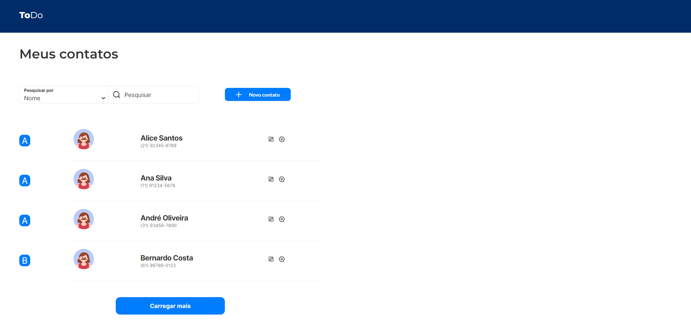

# Desafio Contacts

## Índice

- [Visão Geral](#visão-geral)
  - [O Desafio](#o-desafio)
  - [Screenshot](#screenshot)
  - [Links](#links)
- [Meu processo](#meu-processo)
- [Autor](#autor)

## Visão Geral

### O Desafio

- Criar layout mais próximo do Figma apresentado

### Screenshot

## Meu processo

Primeira Etapa:

- [ ] Desktop-design
  - [x] Implementação tabela
  - [x] Pesquisa nome ou telefone
  - [x] Botão adicionar
  - [x] Paginação com botão (desabilitar no fim)
  - [ ] Apresentar letra índice apenas no primeiro contato
  - [x] Modal adicionar/editar
  - [x] Modal excluir
- [x] Mobile-design
  - [x] Ocultar "Novo contato"

Segunda Etapa:

- [ ] Correção Bugs
  - [x] Pesquisar sem ser palavra ou telefone exato
  - [x] Salvar primeira letra separada no banco de dados
  - [ ] Novo contato
    - [x] Salvar nome com inicial maiúscula
    - [ ] Informar padrão para telefone
  - [ ] Não fazer paginação
  - [ ] Informar dados salvos
  - [ ] Criar índice com primeira letra salva separada
  - [ ] Traduzir erro planilha sem dados
  - [ ] Implantar Tailwind

## Autor

- LinkedIn - [Fernando R Costa](https://www.linkedin.com/in/fernando-r-costa/)